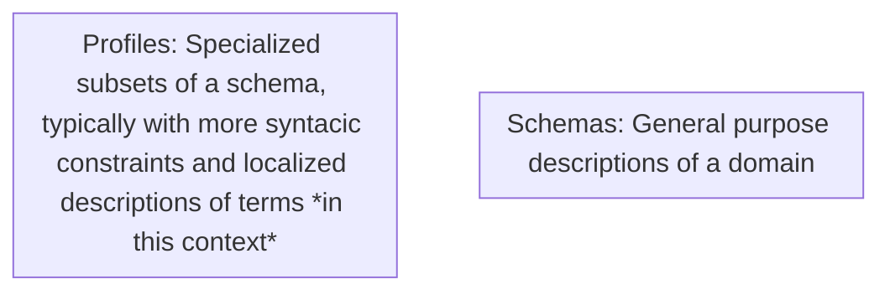
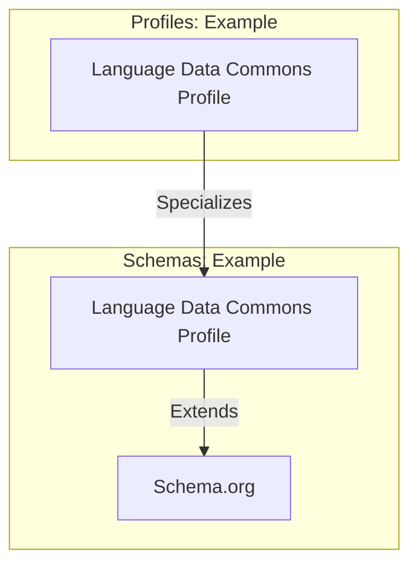
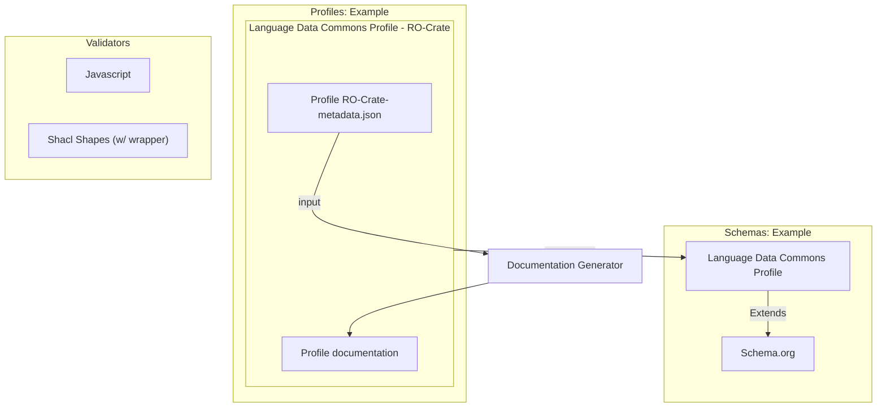

# "*RO-Crate Schemas and Profiles*" (experimental) for Schema.org style schemas plus additional features for validation

This is a work in progress draft implementing the ideas in [Issue 14 in this repository](https://github.com/Language-Research-Technology/ro-crate-schema-tools/issues/14).

Note: Previous drafts of this work used the term "SoSS+ or SoSS Plus".


## Background 

### Definitions

In the context of this document about RO-Crate profiles, the following terms are used.

| Term | Definition |
|------|------------|
| **General Purpose Schema** | A specification/documentation of Classes and Properties of entities and potentially vocabulary terms intended to be used across multiple profiles (E.g. Schema.org, Dublin Core, Darwin Core, et al.). There may be some constraints on the range (expected values) and domain (classes on which a property may occur) but these would typically be more tightly specified in a Profile Specific Schema. A general-purpose schema will typically have inheritance - e.g. a Person is a subClass of Thing. |
| **Schema Language** | The formalisation used to express a schema. These languages may be couched in terms of describing Ontologies, or Vocabularies. Examples include RDF Schema (RDFS), OWL and SKOS and the simple approach used by Schema.org. |
| **SoSS (Schema.org Style Schema)** | Schema.org's data model is not particularly well documented, but the Schema for Schema.org is expressed as a set of Class and Property definitions which are available in a JSON-LD format, RO-Crate compatible. SoSS is a hybrid of RDF, RDFS and Schema.org's own property definition. RO-Crate 1.2 specifies using this SoSS approach for adding extra vocabulary terms which are not defined online to RO-Crates and profiles. See the section on existing RO-Crate support. |
| **Profile Specific Schema** | A schema which has been specialised for use in a particular domain. E.g. for the Language Data Commons there is a general-purpose SoSS for describing language data and context http://w3id.org/ldac/terms and a profile which gives stricter advice about how to use them to make documents for the Language Data Commons of Australia repository: https://w3id.org.ldac/profile. |
| **Class** | A named type which is applied to entities using the @type property, for example, a Person (people are real-world things but describing them as JSON-LD entities is a representation). RO-Crate uses the RDF Schema (rdfs) version of Class as per Schema.org's data model. |
| **Property** | An attribute of an entity. RO-Crate uses the RDF version of property (rdf:Property) as per Schema.org's data model. |
| **Terms** | Terms in a schema or profile are Classes, Properties and Defined Terms. In this document, Defined Terms are other fixed entities defined together with classes or properties. |
| **Profile** | A profile, as defined by the W3C Profiles Vocabularies, is a specialisation of a standard or specification. Compared to a schema, which defines classes and properties that can be used in many ways, a profile introduces constraints, extensions or combinations that make the standard suitable for a particular purpose. RO-Crate for instance, can be seen as a profile of JSON-LD, which we indicate using conformsTo. Profile Crates are again profiles of RO-Crate, where they may constrain or extend for instance which schemas are used, but also on what entities are expected to be found in the crate. |







Both schemas and profiles can be expressed in RO-Crate MASP




### Background: extending Schema.org Style Schemas into a full "RO-Crate Machine Actionable Schemas and Profiles Language"


Schema.org describes its "Schema" using RDF Properties (rdf:Property) and RDF Schema Classes (rdfs:Class), the conventions are described in the Schema.org [Data Model](https://schema.org/docs/datamodel.html).

For example here is the definition of Schema.org's Person class in the Schema.org Style Schema for Schema.org itself:

```
{
      "@id": "schema:Person",
      "@type": "rdfs:Class",
      "owl:equivalentClass": {
        "@id": "foaf:Person"
      },
      "rdfs:comment": "A person (alive, dead, undead, or fictional).",
      "rdfs:label": "Person",
      "rdfs:subClassOf": {
        "@id": "schema:Thing"
      },
      "schema:source": {
        "@id": "http://www.w3.org/wiki/WebSchemas/SchemaDotOrgSources#source_rNews"
      }
    },

```

This class definition indicates that it is a sub-class of `schema:Thing`, and thus in a [General Purpose Schema] for Schema.org, properties from Thing would be allowed on Person.

```
{
      "@id": "schema:author",
      "@type": "rdf:Property",
      "rdfs:comment": "The author of this content or rating. Please note that author is special in that HTML 5 provides a special mechanism for indicating authorship via the rel tag. That is equivalent to this and may be used interchangeably.",
      "rdfs:label": "author",
      "schema:domainIncludes": [
        {
          "@id": "schema:Rating"
        },
        {
          "@id": "schema:CreativeWork"
        }
      ],
      "schema:rangeIncludes": [
        {
          "@id": "schema:Organization"
        },
        {
          "@id": "schema:Person"
        }
      ]
    }

```

There is an mix of terms from different namespaces here, from RDF, RDF Schema and schema.org -- we won't go into this in detail here but follow Schema.org's approach as RO-Crate has done since its inception. 


## Profile Specific Schemas

This section looks at how the SoSS approach can be extended to provide profile-specific schema definitions which meet the requirements set out above.

In summary, the approach builds on existing RO-Crate practice with a few extensions (REQ5):


```
{
      "@id": "#prop_authorOfScholarlyWork", <--- Has an arbitrary local ID which
      "@type": "rdf:Property", <--- Following Schema.org's model this represents an RDF property
      "prov:specializationOf" : {"@id": "https://schema.org/author"}, <--- This is the property that instances of this rule will have
      "rdfs:comment": "The author(s) of this scholarly work.", <---- The 'definition' of the property is context specific to its domain of use (see below)
      "rdfs:label": "author",
      "schema:domainIncludes": [
        {
          "@id": "#class_MainArticle"  <---- This specialized `schema:author` property is found in the context of a specialized class
        }
      ],
      "schema:rangeIncludes": [
        {
          "@id": "#class_Person" <---- The range of values for this is another specialized class
        }
      ],
       "sh:minCount": 1.   <---- This 'minCount' property is borrowed from SHACL it is saying that there MUST be at least one `schema:author` property that meets this property definiton 
    }

```

The above property example implies two more specialized Classes, shown below

```
{
      "@id": "#class_MainArticle",
      "@type": "rdfs:Class",
      "prov:specializationOf" : {"@id": "https://schema.org/ScholarlyArticle"}, 
      "rdfs:comment": "A scholarly article in the context of this profile.",
      "rdfs:label": "ScholarlyArticle"
},

{
      "@id": "#class_AuthorPerson",
      "@type": "rdfs:Class",
      "prov:specializationOf" : {"@id": "https://schema.org/Person"},
      "rdfs:comment": "A person in the context of a scholarly work author.",
      "rdfs:label": "Person"
}
```

Continuing this chain of examples, a profile may mandate that the *Root Data Entity* of crates that conform to this profile must have a `schema:citation` property that links to ScholarlyArticle, specifically, in the Profile definition a particular specialized version: `#class_ScholarlyArticle` as shown in the example above.


```
{
      "@id": "#prop_rootCitation",
      "@type": "rdf:Property",
      "prov:specializationOf" : {"@id": "https://schema.org/citation"},
      "rdfs:comment": "A citation or reference to a scholarly work.",
      "rdfs:label": "citation",
      "schema:domainIncludes": [
        {
          "@id": "#Root_Data_entity"
        }
      ],
      "schema:rangeIncludes": [
        {
          "@id": "schema:ScholarlyArticle"
        }
      ],
      "sh:minCount": 1,
},
{
      "@id": "#Root_Data_Entity", 
      "@type": "rdfs:Class",
      "prov:specializationOf" : {"@id": "https://schema.org/Dataset"},
      "rdfs:comment": "The Root Data Entity for a crate",
      "rdfs:label": "Root_Data_Entity,"  
      "sh:minCount": 1,
      "sh:maxCount": 1,
},

```

Finally, to conclude this example, we need to link the definition of the *RO-Crate Root Data Entity* to the *RO-Crate Metadata Descriptor*.


```
 {
      "@id": "#RO-Crate_Metadata_Descriptor", <-- This is a definition for the RO-Crate Metadata Descriptor which is the "magic" ID for RO-Crate
      "@type": "rdfs:Class",
      "rdfs:label": "RO-Crate Metadadata Descriptor",
      "prov:specializationOf": { "@id": "http://schema.org/CreativeWork" }, <-- This is the required @type for an RO-Crate Metadata Descriptor
      "Description": "An RO-Crate @graph must contain an entity of Type @CreativeWork which is known as the RO-Crate Metadata descriptor.",
      "sh:minCount": 1,
      "sh:maxCount": 1 <-- Max and min count of 1 means MUST have exactly ONE instance of an entity that meets the criteria
    },
    {
        "@id": "#RO-Crate_Metadata_Descriptor.id",
        "@type": "rdf:Property",
        "value": "ro-crate-metadata.json", <--- Using schema.org's `value` property here to express that the id 
        "description": "The RO-Crate Metadata ",
        "rdfs:label": "@id", <--- Strictly speaking JSON-LD @id does not have a URI but this is a way so this property is not a specializtion of anything
        "domainIncludes": [
          {
            "@id": "#RO-Crate_Metadata_Descriptor" <-- This property MUST be present on the Metadata Descriptors see the max and min count props below
          }
        ],
        "rangeIncludes": {"@id": "#Root_Data_Entity"},
        "sh:minCount": 1,
        "sh:maxCount": 1
   },
    {
      "@id": "#RO-Crate_Metadata_Descriptor.about",
      "@type": "rdf:Property",
      "prov:specializationOf": { "@id": "http://schema.org/about" },
      "description": "This property on the RO-Crate Metadata Descriptor references the Root Data Entity. In a SoSS+ profile there may be Schemas present for more than one 'flavour' of Root Data Enitty with different @type arrays or `@conformsTo` references (or other specializations). In this example there is a single reference.",
      "name": "about",
      "domainIncludes": [
        {
          "@id": "#RO-Crate_Metadata_Descriptor"
        }
      ],
      "rangeIncludes": { "@id": "#Root_Data_Entity" },
      "sh:minCount": 1,
      "sh:maxCount": 1
    },
```

The draft Profile Specific RO-Crate schema for RO-Crate itself goes into more detail about this.


# Algorithms for validation / configuring an editor

This section describes the process of validating a Target Crate with a *RO-Crate Schema* Crate, based on the implementation in the `soss-validator.js` library.

## Validation Process Overview

The validation process follows these high-level steps:

1. Load both the _Profile Crate_ (containing schema definitions) and the Target Crate (to be validated)
2. Extract all schema definitions from the Profile Crate, organizing them by type (Classes, Properties, ItemLists)
3. Validate the Target Crate against these schema definitions
4. Generate structured validation results with error, warning, and info messages

### Key Concepts Implemented in the Validator

The current implementation in `soss-validator.js` uses these techniques:

1. **Entity Type Resolution**: The validator resolves entity types through the `prov:specializationOf` property, creating a mapping between specialized types in the profile and their schema.org (or other) base types.

2. **Bidirectional Property Validation**: Properties are validated both from the domain perspective (checking if entities have required properties) and from the range perspective (checking if property values have the correct types).

3. **Cardinality Checking**: The validator enforces `sh:minCount` and `sh:maxCount` constraints for both classes and properties.

4. **Value Validation**: Property values are validated against their specified ranges, which can include:
   - Primitive types (Text, Number, Boolean, Date)
   - Entity references (validated recursively)
   - ItemLists (for enumerated valid values)
   - Fixed values (using `schema:value`)

5. **Both Recursive and iterative Validation**  Entities are validated recursively, following references to ensure that relationships as well as an exhaustive pass of the `@graph` being conducted to make sure unconnected entities are also validated, keeping track of which entities have already been validated against a given rule and only performing validation once.

### Detailed Validation Algorithm

### Handling Multiple Types and Inheritance

The validator handles multiple type values in entities and class inheritance:

1. When an entity has multiple type values, the validator checks it against all matching class definitions
2. Through `prov:specializationOf`, the validator maps specialized classes to their parent classes
3. The validator ensures an entity satisfies all required properties for all of its types

### Editor Configuration Generation

Based on the validator's approach, an editor configuration can be generated that:

1. Creates form sections for each class type
2. Creates form fields for each property within its appropriate section
3. Enforces required fields based on `sh:minCount` values
4. Provides appropriate input controls based on range types:
   - Text inputs for string values
   - Numeric inputs for numbers
   - Date pickers for dates
   - Dropdown selectors for ItemList values
   - Entity reference selectors for object references

This mapping between validation schema and editor configuration allows for dynamic generation of editing interfaces that enforce the same constraints as the validator.

### Special Validation Cases

1. **ItemList Validation**: When a property's range includes an ItemList, the validator checks if the property value matches one of the items in the list:
2. **Fixed Value Validation**: When a property has a `schema:value` constraint, the validator checks if the property value exactly matches the specified value:
3. **Scalar Type Validation**: The validator supports different scalar types including string, number, boolean, and date TODO: This needs to be extended, see REQ8.ii
